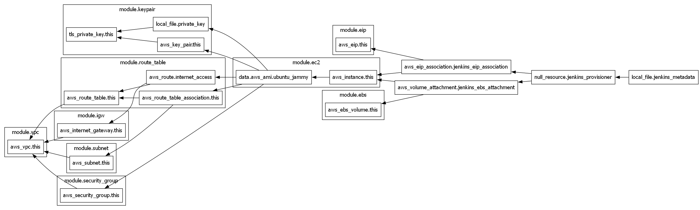
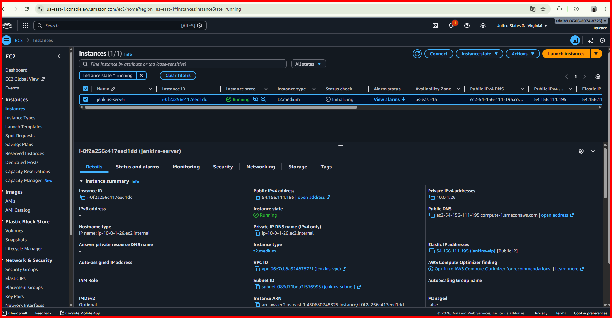
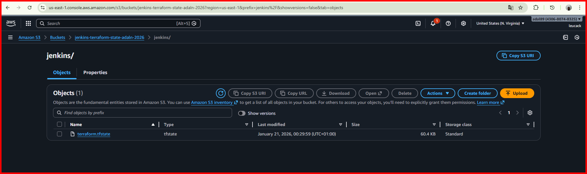
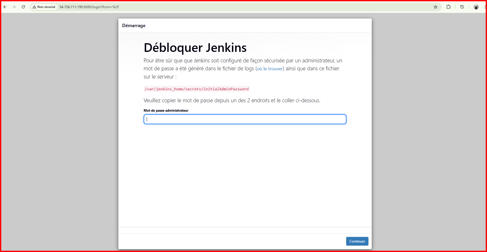
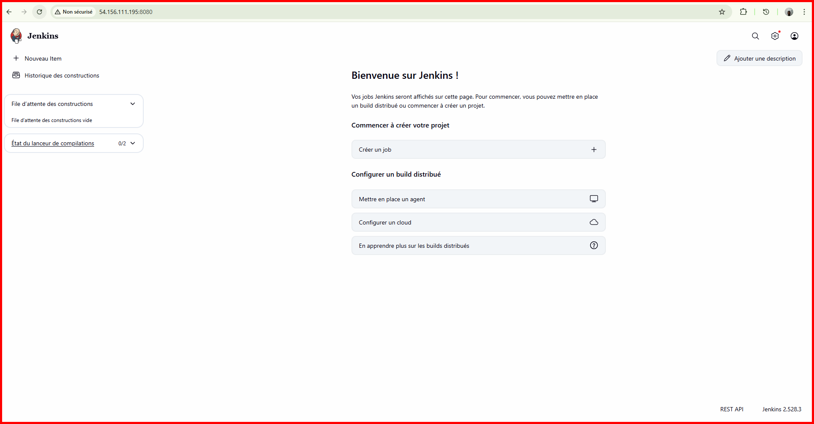

# Mini-Projet Terraform : Déploiement Jenkins sur AWS

Ce projet déploie un serveur Jenkins conteneurisé sur AWS en utilisant Terraform avec une architecture modulaire complète incluant un VPC dédié.

## Architecture

```
jenkins-terraform/
├── app/                           # Application principale
│   ├── main.tf                   # Orchestration des modules
│   ├── variables.tf              # Variables globales
│   ├── outputs.tf                # Outputs du déploiement
│   ├── providers.tf              # Configuration AWS
│   └── files/
│       └── docker-compose.yml    # Configuration Jenkins
│
├── bootstrap/                     # Configuration du backend distant
│   ├── main.tf                   # Création S3 + DynamoDB
│   ├── variables.tf              # Variables du bootstrap
│   ├── outputs.tf                # Configuration backend
│   └── terraform.tfvars.example  # Exemple de configuration
│
└── modules/                       # Modules réutilisables
    ├── vpc/                      # VPC dédié
    ├── subnet/                   # Subnet public
    ├── igw/                      # Internet Gateway
    ├── route_table/              # Table de routage
    ├── ec2/                      # Instance EC2 Ubuntu Jammy
    ├── ebs/                      # Volume EBS
    ├── eip/                      # IP Élastique
    ├── keypair/                  # Paire de clés SSH (dynamique)
    └── security_group/           # Groupe de sécurité
```

## Architecture réseau

```
┌─────────────────────────────────────────────────────────────────┐
│                         VPC (10.0.0.0/16)                       │
│                                                                 │
│   ┌─────────────────────────────────────────────────────────┐   │
│   │              Subnet Public (10.0.1.0/24)                │   │
│   │                                                         │   │
│   │   ┌─────────────────────────────────────────────────┐   │   │
│   │   │              EC2 (Ubuntu Jammy)                 │   │   │
│   │   │                                                 │   │   │
│   │   │  ┌─────────────┐  ┌─────────────────────────┐   │   │   │
│   │   │  │ EBS Volume  │  │  Docker + Jenkins       │   │   │   │
│   │   │  │   (30 GB)   │  │  (Port 8080)            │   │   │   │
│   │   │  └─────────────┘  └─────────────────────────┘   │   │   │
│   │   │                                                 │   │   │
│   │   └─────────────────────────────────────────────────┘   │   │
│   │                           │                             │   │
│   └───────────────────────────┼─────────────────────────────┘   │
│                               │                                 │
│   ┌───────────────────────────┼─────────────────────────────┐   │
│   │                      Route Table                        │   │
│   │                       0.0.0.0/0                         │   │
│   └───────────────────────────┬─────────────────────────────┘   │
│                               │                                 │
└───────────────────────────────┼─────────────────────────────────┘
                                │
                    ┌───────────┴───────────┐
                    │   Internet Gateway    │
                    └───────────┬───────────┘
                                │
                    ┌───────────┴───────────┐
                    │      Elastic IP       │
                    │   (Accès public)      │
                    └───────────────────────┘
```
## Infrastructure schema


   *Infrastructure Terraform*
   
## Prérequis

- Terraform >= 1.0.0
- AWS CLI configuré avec les credentials
- Accès à une région AWS (par défaut: us-east-1)

## Modules

### Modules Réseau

|     Module    |               Description                       |
|---------------|-------------------------------------------------|
| `vpc`         | Crée un VPC dédié avec DNS activé               |
| `subnet`      | Crée un subnet public dans le VPC               |
| `igw`         | Crée une Internet Gateway pour l'accès Internet |
| `route_table` | Crée une table de routage avec route vers l'IGW |

### Modules Compute & Storage

| Module |                        Description                            |
|--------|---------------------------------------------------------------|
| `ec2`  | Instance Ubuntu Jammy 22.04 LTS avec taille/tags variabilisés |
| `ebs`  | Volume EBS chiffré avec taille variabilisée                   |
| `eip`  | Adresse IP élastique pour un accès stable                     |

### Modules Sécurité

|       Module     |                      Description                              |
|------------------|---------------------------------------------------------------|
| `keypair`        | Génération dynamique d'une paire de clés RSA                  |
| `security_group` | Groupe de sécurité avec règles dynamiques (22, 80, 443, 8080) |

## Utilisation

### Étape 1 : Configuration du backend distant (optionnel mais recommandé)

```bash
cd bootstrap

# Copier et modifier le fichier d'exemple
cp terraform.tfvars.example terraform.tfvars
# Modifier bucket_name avec un nom unique

terraform init
terraform apply
```

Ensuite, décommentez la section backend dans `app/providers.tf` et mettez à jour les valeurs.

### Étape 2 : Déploiement de l'infrastructure

```bash
cd app
terraform init
terraform plan
terraform apply
```

### Étape 3 : Accéder à Jenkins

Après le déploiement, récupérez l'URL Jenkins:

```bash
terraform output jenkins_url
```

### Étape 4 : Obtenir le mot de passe initial Jenkins

```bash
# Se connecter en SSH
ssh -i jenkins-key.pem ubuntu@<PUBLIC_IP>

# Récupérer le mot de passe initial
sudo docker exec jenkins cat /var/jenkins_home/secrets/initialAdminPassword
```

## Variables personnalisables

### Variables Réseau

|       Variable      |  Description   |     Défaut       |
|---------------------|----------------|------------------|
| `vpc_name`          | Nom du VPC     | `jenkins-vpc`    |
| `vpc_cidr_block`    | CIDR du VPC    | `10.0.0.0/16`    |
| `subnet_name`       | Nom du subnet  | `jenkins-subnet` |
| `subnet_cidr_block` | CIDR du subnet | `10.0.1.0/24`    |

### Variables Compute

|      Variable       |       Description         |      Défaut      |
|---------------------|---------------------------|------------------|
| `aws_region`        | Région AWS                | `us-east-1`      |
| `availability_zone` | Zone de disponibilité     | `us-east-1a`     |
| `instance_type`     | Type d'instance EC2       | `t2.medium`      |
| `instance_name`     | Nom de l'instance         | `jenkins-server` |
| `ebs_volume_size`   | Taille du volume EBS (GB) | `30`             |

### Exemple de fichier terraform.tfvars

```hcl
# Configuration AWS
aws_region        = "eu-west-1"
availability_zone = "eu-west-1a"
environment       = "production"

# Configuration Réseau
vpc_name          = "jenkins-prod-vpc"
vpc_cidr_block    = "10.0.0.0/16"
subnet_cidr_block = "10.0.1.0/24"

# Configuration Compute
instance_type   = "t3.medium"
instance_name   = "jenkins-prod-server"
ebs_volume_size = 50

# Tags
common_tags = {
  Application = "Jenkins"
  Environment = "Production"
  Owner       = "DevOps-Team"
}
```

## Outputs

|    Output     |          Description           |
|---------------|--------------------------------|
| `jenkins_url` | URL d'accès à Jenkins          |
| `public_ip`   | Adresse IP publique            |
| `public_dns`  | Nom DNS public                 |
| `ssh_command` | Commande SSH pour se connecter |
| `vpc_id`      | ID du VPC                      |
| `subnet_id`   | ID du subnet                   |

## Fichier de métadonnées

Après le déploiement, un fichier `jenkins_ec2.txt` est généré contenant:
- IP publique et nom de domaine
- Informations réseau (VPC, Subnet)
- Informations sur l'instance
- Commande SSH
- Instructions pour le mot de passe Jenkins

## Bonnes pratiques appliquées

- ✅ Architecture modulaire et réutilisable (9 modules)
- ✅ Infrastructure réseau complète (VPC, Subnet, IGW, Route Table)
- ✅ Génération dynamique des clés SSH
- ✅ Variables typées avec descriptions
- ✅ Règles de sécurité dynamiques (for_each)
- ✅ Volumes EBS chiffrés (gp3)
- ✅ Tags cohérents sur toutes les ressources
- ✅ Jenkins conteneurisé avec Docker Compose
- ✅ Export automatique des métadonnées
- ✅ Support backend S3 + DynamoDB (state locking)

## Génération du schéma d'infrastructure

Le projet inclut des scripts pour générer automatiquement un schéma PNG de l'infrastructure.

### Prérequis

Installer Graphviz :
```bash
# Windows (Chocolatey)
choco install graphviz

# Windows (winget)
winget install graphviz

# Ubuntu/Debian
sudo apt-get install graphviz

# MacOS
brew install graphviz
```

### Utilisation

```bash
# Windows (PowerShell)
.\scripts\generate-graph.ps1
.\scripts\generate-graph.ps1 -OpenAfter  # Ouvre le fichier après génération

# Linux/MacOS
chmod +x scripts/generate-graph.sh
./scripts/generate-graph.sh
./scripts/generate-graph.sh png infrastructure true  # Ouvre après génération
```

Le schéma sera généré dans le dossier `docs/infrastructure.png`.

## Logs de déploiement

### Bootstrap S3 (Backend State)

```
# À compléter lors du prochain déploiement
```

### Application (Infrastructure Jenkins)

```
Apply complete! Resources: 17 added, 0 changed, 0 destroyed.

Outputs:

ami_id = "ami-0030e4319cbf4dbf2"
ami_name = "ubuntu/images/hvm-ssd/ubuntu-jammy-22.04-amd64-server-20251212"
availability_zone = "us-east-1a"
ebs_volume_id = "vol-07866c5422a7ef882"
ebs_volume_size = 30
igw_id = "igw-09ee89672abf41d0b"
instance_id = "i-0f2a256c417eed1dd"
instance_type = "t2.medium"
jenkins_url = "http://54.156.111.195:8080"
key_name = "jenkins-key"
metadata_file = "./jenkins_ec2.txt"
private_ip = "10.0.1.26"
private_key_path = "./jenkins-key.pem"
public_dns = "ec2-54-156-111-195.compute-1.amazonaws.com"
public_ip = "54.156.111.195"
route_table_id = "rtb-043537b85ed479e31"
security_group_id = "sg-00471cd38c1a3e046"
ssh_command = "ssh -i ./jenkins-key.pem ubuntu@54.156.111.195"
subnet_cidr = "10.0.1.0/24"
subnet_id = "subnet-083d71bda3f576995"
vpc_cidr = "10.0.0.0/16"
vpc_id = "vpc-06e7cb8a32487872f"
```
### Server jenkins connect
```
adaln@Lenov_nta MINGW64 ~/EAZYTRAINING/DevOpsBootCamps/Terraform/Terraform_AWS/TERRAFORM_TRAINING/mini-project-terraforms_bc/jenkins-terraform/app
$ ssh -i ./jenkins-key.pem ubuntu@54.156.111.195
The authenticity of host '54.156.111.195 (54.156.111.195)' can't be established.
ED25519 key fingerprint is SHA256:gex4447Ck/otE1ZGQjchAI1++n7AXgb2IkTXVKcXJ2E.
This key is not known by any other names.
Are you sure you want to continue connecting (yes/no/[fingerprint])? yes
Warning: Permanently added '54.156.111.195' (ED25519) to the list of known hosts.
Welcome to Ubuntu 22.04.5 LTS (GNU/Linux 6.8.0-1044-aws x86_64)

 * Documentation:  https://help.ubuntu.com
 * Management:     https://landscape.canonical.com
 * Support:        https://ubuntu.com/pro

 System information as of Wed Jan 21 00:01:28 UTC 2026

  System load:  0.0                Processes:             122
  Usage of /:   16.5% of 19.20GB   Users logged in:       0
  Memory usage: 21%                IPv4 address for eth0: 10.0.1.26

 System information as of Wed Jan 21 00:01:28 UTC 2026

  System load:  0.0                Processes:             122
  Usage of /:   16.5% of 19.20GB   Users logged in:       0
  Memory usage: 21%                IPv4 address for eth0: 10.0.1.26
 System information as of Wed Jan 21 00:01:28 UTC 2026

  System load:  0.0                Processes:             122
  Usage of /:   16.5% of 19.20GB   Users logged in:       0
  Memory usage: 21%                IPv4 address for eth0: 10.0.1.26

  System load:  0.0                Processes:             122
  Usage of /:   16.5% of 19.20GB   Users logged in:       0
  Memory usage: 21%                IPv4 address for eth0: 10.0.1.26
  System load:  0.0                Processes:             122
  Usage of /:   16.5% of 19.20GB   Users logged in:       0
  Memory usage: 21%                IPv4 address for eth0: 10.0.1.26
  Memory usage: 21%                IPv4 address for eth0: 10.0.1.26
  Swap usage:   0%
  Swap usage:   0%


Expanded Security Maintenance for Applications is not enabled.
Expanded Security Maintenance for Applications is not enabled.

27 updates can be applied immediately.
26 of these updates are standard security updates.

27 updates can be applied immediately.
26 of these updates are standard security updates.
26 of these updates are standard security updates.
To see these additional updates run: apt list --upgradable
To see these additional updates run: apt list --upgradable


Enable ESM Apps to receive additional future security updates.
Enable ESM Apps to receive additional future security updates.
See https://ubuntu.com/esm or run: sudo pro status

New release '24.04.3 LTS' available.
Run 'do-release-upgrade' to upgrade to it.
Run 'do-release-upgrade' to upgrade to it.
Run 'do-release-upgrade' to upgrade to it.


Last login: Tue Jan 20 23:28:53 2026 from 176.187.74.67
ubuntu@ip-10-0-1-26:~$ sudo docker exec jenkins cat /var/jenkins_home/secrets/initialAdminPassword
26da31b0d91145fdbb24cd17b5432198
ubuntu@ip-10-0-1-26:~$ exit
logout
Connection to 54.156.111.195 closed.
```

## Destruction de l'infrastructure

```bash
cd app
terraform destroy
```

Si vous avez utilisé le backend distant:
```bash
cd bootstrap
terraform destroy
```
## Screenshots


   *AWS jenkins instances*


   *terraform tfstate s3 bucket*


   *jenkins apps login/password*


   *jenkins apps homepage*   

## Auteur

Projet réalisé dans le cadre du Bootcamp DevOps - EazyTraining
